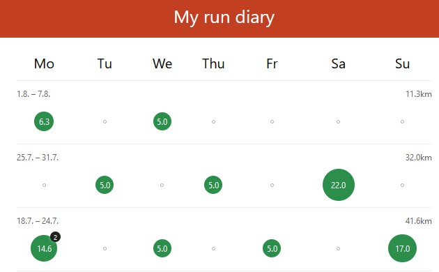
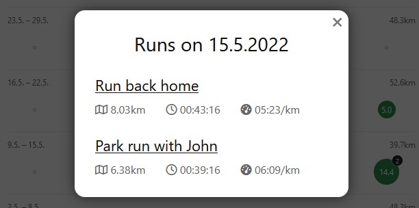

# Run diary

In the paid version of [Strava](https://www.strava.com) the training log is a very useful feature. Unfortunately, it's not available in the free version. But you can just build it yourself! You can use this repository as a template for that.

The diary lists all your runs in form of "bubbles" whose sizes correspond to the total amount of kilometers on that day. By clicking on them you get a more detailed overview over the runs. They are linked to the respective Strava pages with more details.
 

Of course you have to import your runs from Strava (see below).

## Usage

1. This is a [Svelte](https://svelte.dev) project. When you clone it, run `npm install` to install all the packages. Run `npm run dev` to start the development server and `npm run build` to build the app for production.

2. In the folder `public/data` there is a `export.csv` file which should contain all your runs. The columns are as specified there. I use [flink](app.flink.run) to export my runs from Strava. (I have to do this manually on a regular basis to keep the runs uptodate, you can probably automate this. The best alternative would be to use the Strava API, which however requires more effort.)

3. Change titles and texts in the components as you like.

4. Deploy the site wherever you want. (In my version, I have deployed it to Netlify and password-protected it via a serverless function, since I want to keep my runs private. So this here is actually a simplified version of what I actually use for myself.)

5. The responsive design makes it possible to use the site on a phone as well. I put my run diary on the phone's start screen.